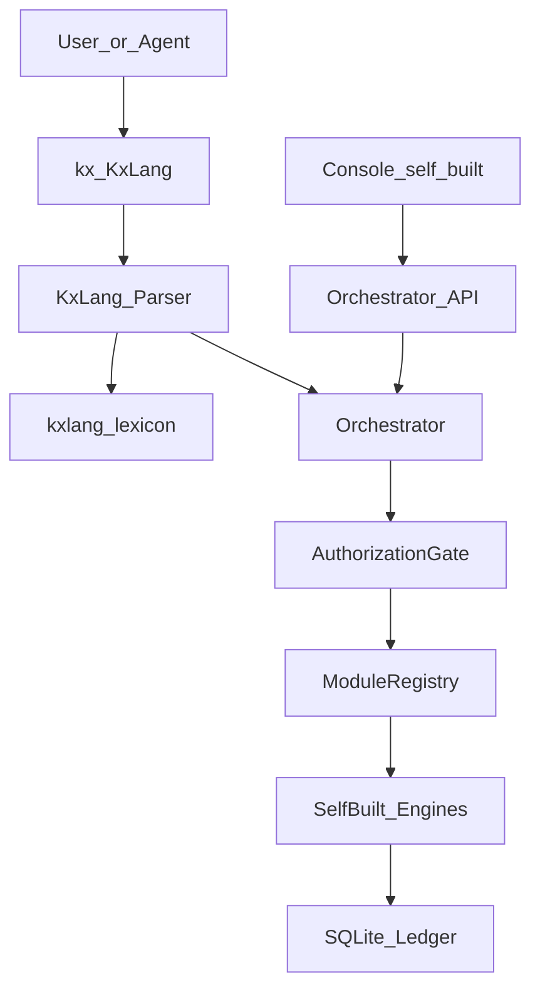
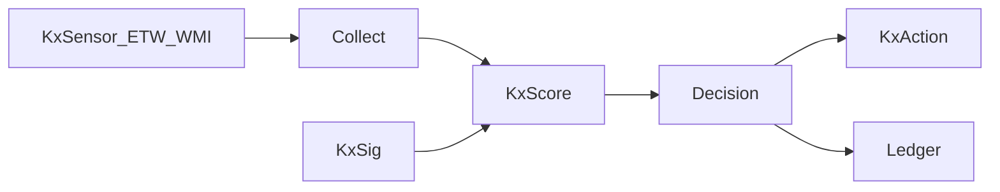

# Kx-Defender — 실제 프로그램 구상 (Architecture)

**관련 PRD**: [`docs/prd/kx-defender-v3.md`](prd/kx-defender-v3.md)  
**Self-Built Only**: [`docs/policy-self-built.md`](policy-self-built.md)  
**명령 언어**: [`docs/kxlang.md`](kxlang.md)

---

## 1. 제품 한 줄

> **Kx-Defender = KxLang 셸 + 자체 오케스트레이터 + 자체 모듈 엔진 + Ledger + (후속) 자체 Console**

외부 보안 프로그램은 **가져오지 않고, 호출하지 않고, 감싸지 않는다.**  
사용자가 알려준 스킬은 **능력 목록(무엇을 만들 것인가)** 일 뿐, 구현체는 전부 이 레포의다.

---

## 2. 논리 아키텍처



Engines 예:
- `KxRoast` / `KxRelay` / `KxLoot` / `KxBait` / `KxBreach`
- `KxCrack` / `KxNexus` / `KxGraph` / `KxProbe` / `KxSweep`
- `KxWatch` / `KxSentry` / `KxSig` / `KxScore`

이름만 스킬 개념과 대응하고, **코드는 전부 자체 구현**.

---

## 3. 배포 형태

### 현재
```
kx / kxctl   (Python, stdlib CLI)
modules/     (자체 엔진)
fixtures/    (랩 데이터)
```

### 목표
```
Kx-Defender/
  bin/kx(.exe)
  console/          # 자체 UI
  modules/
  rules/kxsig/      # 자체 시그니처
  rules/kxrule/     # 자체 탐지 규칙
  data/ledger.db
```

**금지**: `vendor/impacket`, `tools/aircrack`, `bin/havoc` 같은 외부 툴 트리.

---

## 4. 데이터 계약

`ModuleResult` JSON 스키마는 모든 엔진 공통.  
UI/에이전트는 스키마만 소비한다.

인가:
- `--sim` 기본
- `--live`는 lab/private/pact만

---

## 5. 모듈 원칙

1. Self-built first (정책 문서 강제)
2. Simulate default
3. No malware surface (implant/AMSI bypass 없음)
4. KxLang objects = 제품 이름
5. 지정 스킬 카탈로그 = capability index → 자체 handler/엔진

---

## 6. Console (후속)

자체 UI. 버튼이 KxLang을 생성한다.  
시각적 무드만 참고 가능. 외부 터미널 앱을 내장하지 않는다.

패널: Sentry / Strike / Sweep / Nexus / Ledger

---

## 7. Windows 방어 엔진 (Phase B, 자체)



- `KxSig`: 자체 패턴/해시/문자열 규칙 (외부 YARA 바이너리 사용 안 함; 필요 시 호환 문법 **재구현**)
- `KxRule`: 자체 탐지 룰 포맷

---

## 8. 로드맵

| Step | 내용 |
|---|---|
| 1 | Language lock ✅ |
| 2 | Self-Built Only 정책 고정 ✅ |
| 3 | Defense vertical: KxSensor + KxSig + kill |
| 4 | Strike engines 심화 (자체 프로토콜) |
| 5 | Console |
| 6 | Rule packs |

---

## 9. 에이전트 계약

1. `skills/kxlang` 사용
2. `kx /h` 확인
3. **`kx ...`만 실행**
4. 외부 툴 설치/호출 제안 금지
5. 지정 스킬 이름은 능력 설명용; 구현은 이미/앞으로 **이 레포 모듈**

---

## 10. 완료 정의

1. 외부 보안 프로그램 의존 0  
2. `kx /h`로 제품 언어 설명  
3. 지정 스킬 능력이 자체 엔진으로 동작  
4. Windows live 센서 자체 구현  
5. Console이 KxLang 클라이언트  
6. 정책 문서와 코드 불일치 0  
