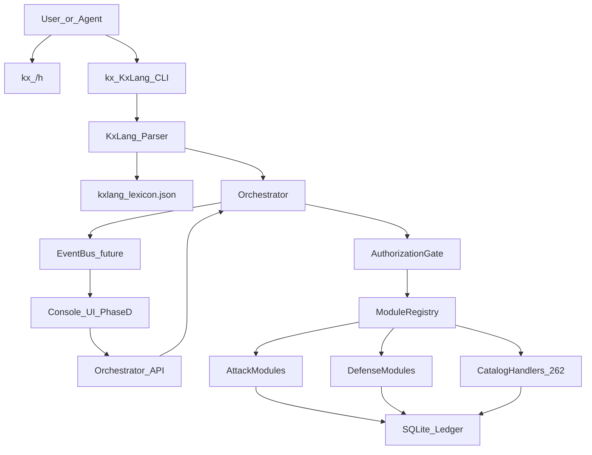
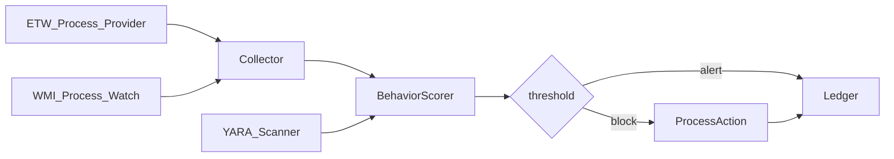

# Kx-Defender — 실제 프로그램 구상 (Architecture)

**관련 PRD**: [`docs/prd/kx-defender-v3.md`](prd/kx-defender-v3.md)  
**명령 언어**: [`docs/kxlang.md`](kxlang.md)

이 문서는 “무엇을 만들지”가 아니라 **어떻게 한 프로그램으로 조립할지**를 고정한다.

---

## 1. 제품 한 줄 정의

> **Kx-Defender = KxLang 셸 + 오케스트레이터 + (공격/방어) 모듈 런타임 + Ledger(DB) + (후속) Console UI**

사용자는 Impacket/ZAP/Garak 이름을 몰라도 된다.  
오직 `kx <verb> <object> ...` 만 알면 된다.

---

## 2. 논리 아키텍처



### 계층
| Layer | 책임 | 현재 코드 |
|---|---|---|
| **Presentation** | KxLang CLI, `/h`, (후속) Console | `kx_cli.py`, `helptext.py` |
| **Language** | 문법 파싱, lexicon 해석 | `kxlang.py`, `kxlang_lexicon.json` |
| **Orchestration** | 모듈 실행, 결과 저장 | `orchestrator.py`, `registry.py` |
| **Policy** | 인가/모드/대상 제한 | `auth.py` |
| **Modules** | 실제 워크플로 | `modules/attack/*`, `modules/defense/*`, `modules/catalog/*` |
| **Ledger** | run 이력 | `store.py` → `data/kx_defender.db` |

---

## 3. 런타임 형태 (목표 배포물)

### 3.1 지금 (Phase A)
단일 Python 패키지:

```
kx          → KxLang front-door
kxctl       → low-level module tool
```

설치:

```bash
pip install -e ".[dev]"
kx /h
```

### 3.2 목표 Windows 앱 (Phase B–D)

```
Kx-Defender/
  bin/
    kx.exe              # CLI 진입점
    kx-orchestratord    # 백그라운드 서비스(선택)
  console/
    Kx Console.exe      # Electron/Tauri UI
  modules/              # 버전된 모듈 팩
  rules/                # YARA/Sigma packs
  data/                 # ledger, configs (encrypted)
```

- **CLI-first**: UI가 없어도 제품 성립
- **UI는 KxLang 클라이언트**: 버튼 = `kx ...` 문자열 생성

---

## 4. 핵심 데이터 계약

### 4.1 ModuleResult (불변 스키마)
```json
{
  "run_id": "uuid",
  "module": "performing-kerberoasting-attack",
  "status": "ok|denied|error",
  "mode": "simulate|execute",
  "authorized_scope": "lab|owned|engagement",
  "findings": [{"title": "...", "severity": "info|low|medium|high|critical", "detail": "..."}],
  "artifacts": {},
  "errors": [],
  "kxlang": {"verb": "roast", "object": "tickets", "raw": "..."}
}
```

모든 모듈은 이 스키마만 반환한다. UI/리포트/에이전트는 스키마만 알면 된다.

### 4.2 Authorization
| mode | 조건 |
|---|---|
| `simulate` (`--sim`) | `--scope`만 있으면 |
| `execute` (`--live`) | localhost / RFC1918 / `.lab|.local|.test` / pact allow-list / lab fixture token |

`pact` → 내부 `engagement`.

---

## 5. 모듈 설계 원칙

1. **Self-built first** — 외부 SaaS API 키 없음
2. **Simulate default** — 안전한 기본 경로
3. **No malware surface** — 임플란트/셸코드/AMSI 우회 없음
4. **KxLang objects are product names** — 내부 모듈명은 숨김
5. **Catalog handlers scale defense breadth** — 262 이름은 UX에 직접 노출하지 않고 `sentry/trace/...`로 수렴

### 5.1 공격 코어 (Strike)
| KxLang | 모듈 역할 |
|---|---|
| `roast` | SPN/TGS 랩 파이프라인 |
| `relay` | ESC8 상태머신 |
| `loot` | DPAPI fixture decode |
| `bait` | mock IdP device-code |
| `breach` | Entra recon lab |
| `crack` | WiFi handshake fixture |
| `nexus` | listener/session only |
| `graph` | mock Graph collection |
| `probe` | local LLM red-team |
| `sweep` | web scanner / testing-for |

### 5.2 방어 코어 (Sentry)
| KxLang | 모듈 역할 |
|---|---|
| `watch` | 프로세스 |
| `sentry` | detecting family |
| `trace` | analyzing family |
| `audit` / `harden` / `triage` / `comply` / `forge` | 각 family |

---

## 6. Console UI 구상 (Phase D)

### 6.1 정보 구조
1. **Top bar**: scope 배지 (`LAB`/`OWNED`/`PACT`), sim/live 토글
2. **Command strip**: KxLang 입력 + `/h` 오버레이
3. **Panels**
   - **Sentry**: 프로세스 트리, 탐지 피드
   - **Strike**: roast/relay/loot… 위자드 (생성 명령 미리보기)
   - **Sweep**: URL, 진행률, findings
   - **Nexus**: listeners/sessions
   - **Ledger**: run history, JSON detail

### 6.2 시각 방향 (PRD 정렬, 과한 카드 UI 지양)
- 배경: 깊은 블랙 + 미세 그리드/스캔라인
- 액센트: cyan `#00D9FF`, alert `#FF6600`
- 폰트: IBM Plex Mono / JetBrains Mono
- 모션: 명령 전송 시 짧은 scan, findings 등장 fade (2–3개)

### 6.3 UI → Engine
```
UI action → build KxLang string → Orchestrator.run → Result → bind to panel
```
UI가 모듈을 직접 import하지 않는다.

---

## 7. Windows 방어 엔진 구상 (Phase B)



- Collector는 관리자 권한 서비스로 분리 가능
- `kx watch procs --live`, `kx sentry detect --live`가 동일 엔진 조회
- 차단은 명시적 확인 또는 정책 프로파일 필요

---

## 8. 디렉터리 목표 구조

```
kx-defender/
  docs/
    prd/kx-defender-v3.md
    architecture.md          ← 본 문서
    kxlang.md
  services/
    orchestrator/            ← Python core (현재)
    windows-sensor/          ← Phase B (C#/Rust/Python)
  modules/
    attack/
    defense/
    catalog/
  apps/
    console/                 ← Phase D UI
  fixtures/
  skills/                    ← Cursor agent (KxLang)
  tests/
```

---

## 9. 구현 로드맵 (기술적 순서)

### Step 1 — Language Lock (done)
- KxLang + `/h` + lexicon + tests

### Step 2 — Defense Vertical Slice
- Windows sensor MVP → `watch` live
- 1개 behavioral rule + kill action
- Ledger에 defense events

### Step 3 — Strike Lab Slice
- roast/relay/loot fixture → private-lab live adapters
- sweep HTML report
- nexus session persistence

### Step 4 — Console
- Command palette + Ledger + Sentry panel only ( thrash-free MVP )
- 이후 Strike/Sweep/Nexus 패널

### Step 5 — Packs
- YARA/Sigma rule packs
- Compliance evidence export (`comply`)

---

## 10. 에이전트/자동화 계약

Cursor 에이전트는:
1. `skills/kxlang`을 읽고
2. `kx /h`로 확인한 뒤
3. **오직 `kx ...` 명령을 실행**한다

금지:
- Anthropic 스킬명을 사용자 명령처럼 사용
- 인가 게이트 우회 자동화
- 임플란트/우회 코드 생성 요청 수행

---

## 11. 보안·컴플라이언스 가드레일

| 가드 | 구현 |
|---|---|
| 기본 sim | `--live` 명시 없으면 simulate |
| 대상 제한 | auth.py private/lab/pact |
| 시크릿 마스킹 | `mask_secret` |
| 감사 | 모든 run SQLite 기록 |
| 라이선스 | Apache-2.0 + NOTICE |
| 악용 표면 축소 | no implant / no AMSI bypass |

---

## 12. 완료 정의 (프로그램으로서)

“프로그램이 있다”의 기준:

1. 설치 후 `kx /h`가 제품 언어를 설명하고
2. 대표 Strike/Sentry 명령이 동일 Ledger에 쌓이며
3. Windows에서 `watch`/`sentry` live가 실제 프로세스를 보고
4. Console이 KxLang을 실행하는 조작면이 되며
5. PRD v3와 본 아키텍처가 코드와 어긋나지 않는다.

현재 레포는 **1–2번(기반)까지 달성**, 3–4번은 다음 구현 대상이다.
